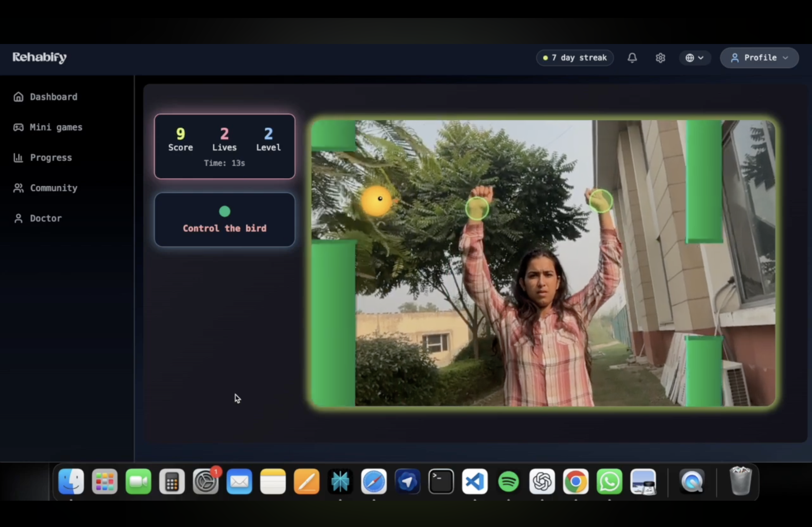
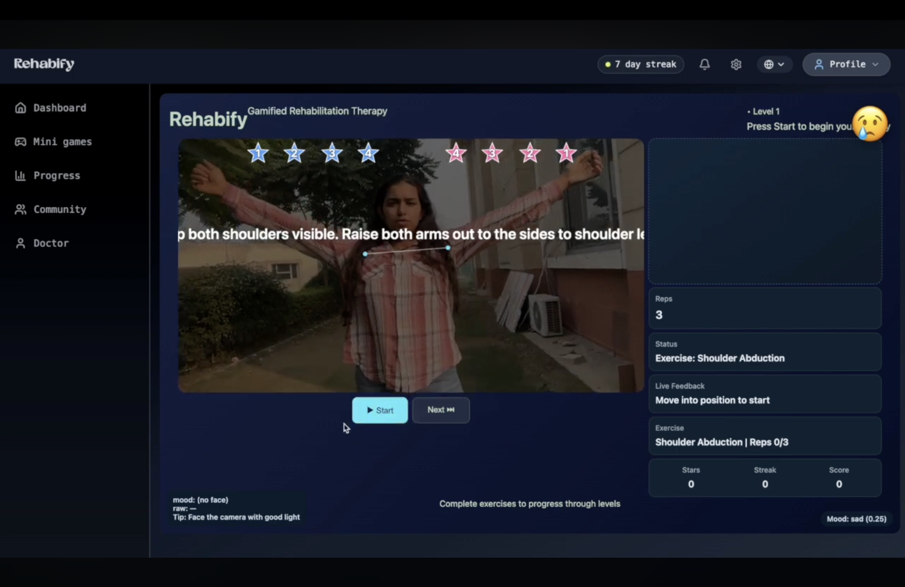
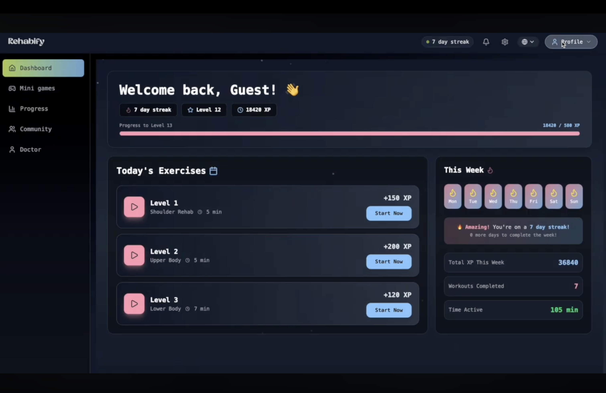
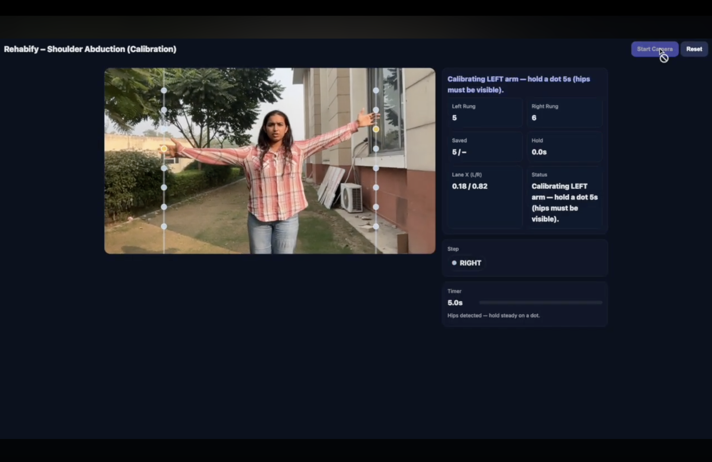
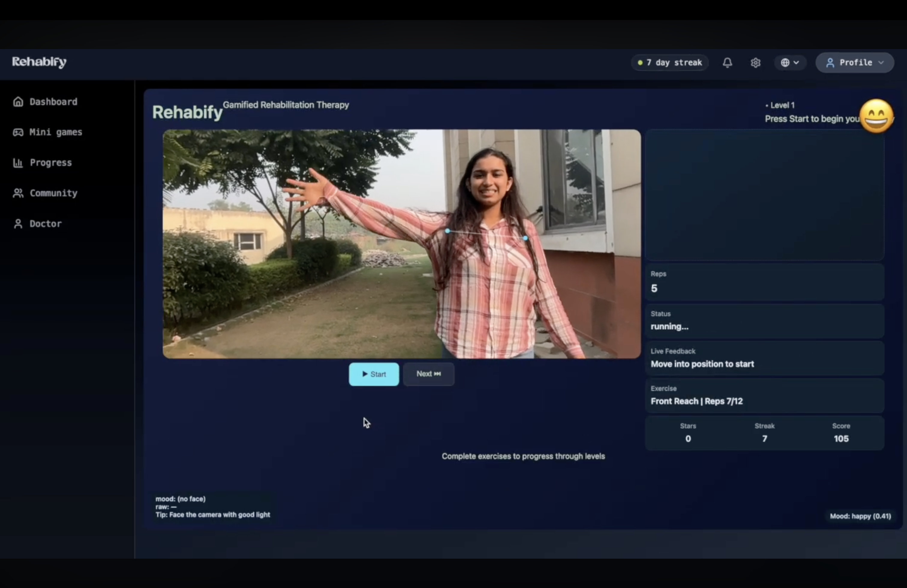

# Rehabify  
### Gamifying Rehabilitation with AI Motion Tracking

Rehabify transforms traditional physiotherapy into an **interactive gaming experience**.  
Using real-time pose detection and gamified exercises, Rehabify helps patients stay motivated during rehabilitation.

Instead of repetitive therapy routines, users complete **motion-based challenges similar to fitness and dance games**.

---

# 🎮 Demo
https://www.youtube.com/watch?v=C_XPJi3eGrs

The demo should show:

• Pose tracking  
• Exercise gameplay  
• Scoring system  
• UI interaction  

---

# Key Features

## Gamified Physiotherapy Exercises

Rehabify converts rehabilitation movements into fun mini-games that improve motivation and engagement.

Examples:

• Arm Raise Challenge  
• Balance Stability Game  
• Reach & Stretch Game  
• Reaction Speed Training  

---

## Real-Time Motion Tracking

The platform uses **AI pose estimation** to analyze body movements through a webcam.

Features:

• Real-time skeleton detection  
• Exercise posture tracking  
• Movement accuracy scoring  

---

## Music-Driven Therapy

Exercises are synced with music to improve rhythm and engagement.

Benefits:

• More enjoyable therapy sessions  
• Rhythm-based movement exercises  
• Adaptive pacing  
---

## Accuracy & Feedback System

Users receive real-time performance analysis.

Metrics include:

• Accuracy score  
• Repetition tracking  
• Completion feedback  

---

# System Architecture

User Webcam  
↓  
Pose Detection (MediaPipe)  
↓  
Movement Analysis Engine  
↓  
Gamified Exercise Interface  
↓  
Performance Scoring System  

---

# Tech Stack

Frontend  
• React  
• Tailwind CSS  
• JavaScript  

Computer Vision  
• MediaPipe Pose  
• Web Camera API  

Backend  
• Node.js  

APIs  
• Spotify API  

---

# UI Showcase

## Home Screen

---

## Exercise Gameplay

---

# Installation

Clone the repository

git clone https://github.com/yourusername/rehabify.git

Navigate to the project

cd rehabify

Install dependencies

npm install

Run the development server

npm start

Open the application

http://localhost:3000

---

# Future Improvements

• AI-based posture correction  
• Personalized recovery plans  
• Therapist monitoring dashboard  
• Mobile app integration  
• Multiplayer rehabilitation games  

---

# Contributors

**Yash Aggarwal**  
Computer Engineering Student  
Thapar Institute of Engineering & Technology  

Hackathon Project — Gamifying Rehabilitation

---

# Inspiration

Rehabilitation is often repetitive and discouraging.  
Rehabify aims to transform recovery into a **motivating and enjoyable experience** by combining **AI, computer vision, and game design**.

---

⭐ If you like the project, consider starring the repository!
